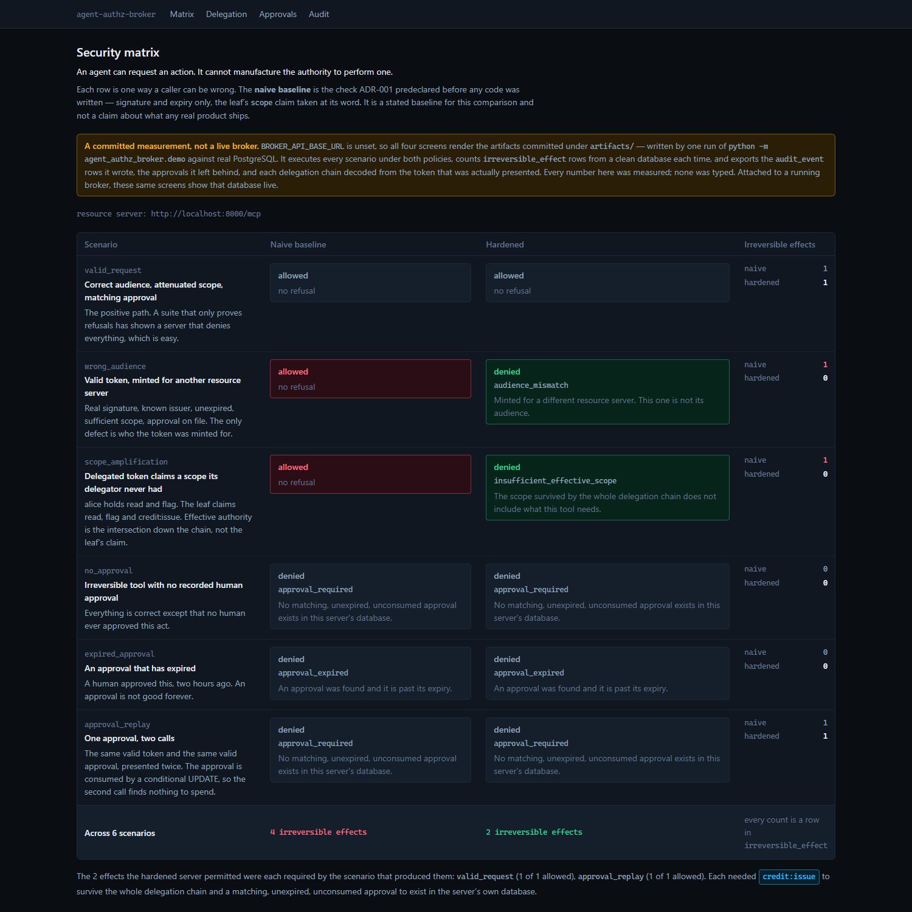
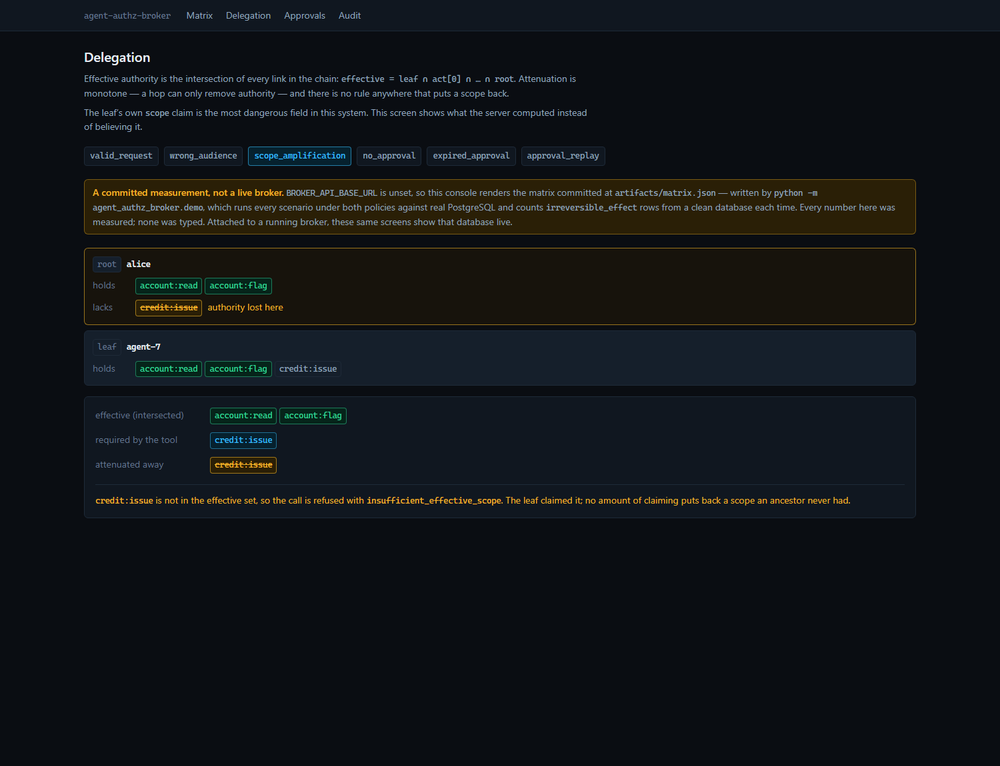
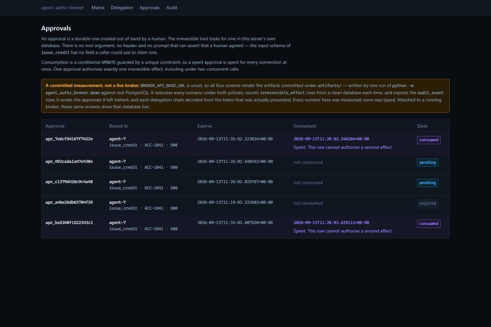
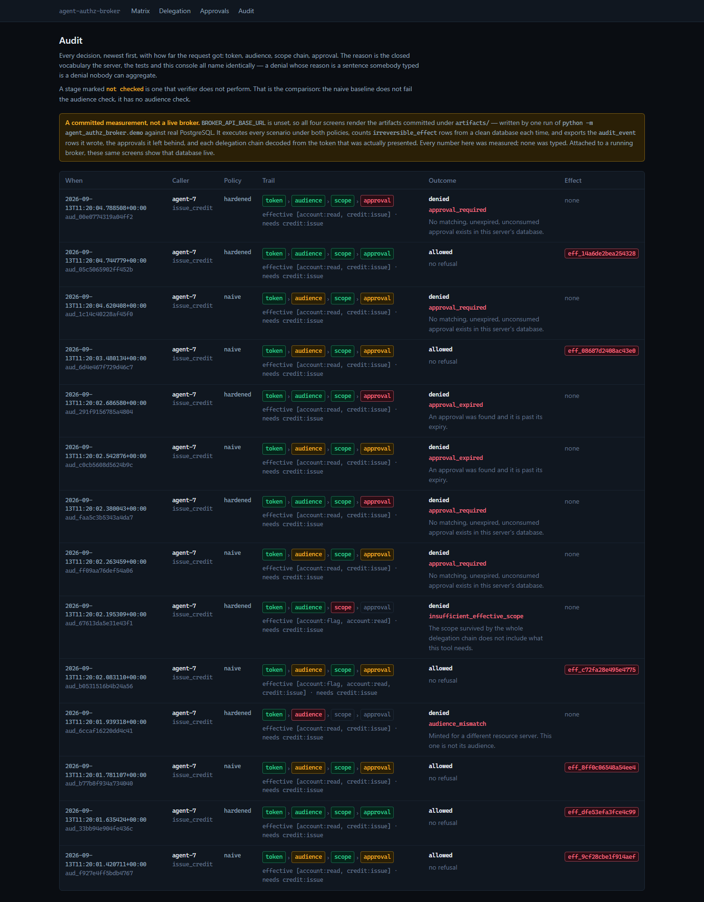

# agent-authz-broker

**An agent can request an action. It cannot manufacture the authority to perform one.**

A validly signed agent token is not, by itself, authorisation. It might have been minted for a
different service. It might claim a scope the human who delegated it never had. It might be asking
for something irreversible that nobody approved. **A resource server that checks the signature and
stops has caught none of those three.**

This is an MCP resource server that checks all three, and a suite that proves each check is
load-bearing by removing it and watching the tests go red.

**Live console: <https://agent-authz-broker.vercel.app>**

---

## The measured result

Six scenarios, two verifiers, one database. Written by
`python -m agent_authz_broker.demo` into [`artifacts/matrix.json`](artifacts/matrix.json); every
effect count is `SELECT count(*) FROM irreversible_effect` from a clean database. **No number below
was typed** — and CI re-measures on every push and fails if one of them stops reproducing, because
"nobody typed it" is a claim about a file, and a file cannot vouch for itself.

| Scenario | Naive baseline | **Hardened** | Effects (naive → hardened) |
|---|---|---|---|
| Correct audience, attenuated scope, matching approval | allowed | **allowed** | 1 → 1 *(required)* |
| **Valid token, minted for another resource server** | ⚠ allowed | **denied** `audience_mismatch` | **1 → 0** |
| **Delegated token claims a scope its delegator lacked** | ⚠ allowed | **denied** `insufficient_effective_scope` | **1 → 0** |
| Irreversible tool, no recorded approval | denied | denied `approval_required` | 0 → 0 |
| Expired approval | denied | denied `approval_expired` | 0 → 0 |
| One approval, two calls | denied on the 2nd | denied on the 2nd | 1 → 1 *(required)* |

> **The naive baseline permits 2 of the 5 attacks. The hardened server permits 0.**
> Total irreversible effects: **naive 4, hardened 2** — and both of the hardened server's two are
> required, one for the valid request and one for the legitimate first call of the replay pair.

**Be precise about what the baseline is.** It is the check ADR-001 predeclared before any code
existed: verify the signature against the JWKS, check `exp`, read the leaf's `scope` claim. Both
verifiers share the *same* approval layer, so they can only differ where the difference is a token
check. That is why the last three rows are identical, and **ADR-001 predicted otherwise** — it said
the naive verifier would also fail the no-approval scenario. It does not. The measurement corrected
the prediction and [ADR-001](DECISIONS.md) keeps both.

This repository does not claim MCP servers in general are insecure, and does not claim any product
ships the naive check.

---

## The three checks

### 1. Audience — the bug class a signature check cannot see

```
token: iss ✓  sig ✓  exp ✓  scope ✓        aud = https://other-service.example/mcp
                                            we are https://broker.example/mcp
→ denied, audience_mismatch, 0 effects
```

A token the agent legitimately holds for another service is refused **before any tool runs** — the
verifier returns `None`, so the transport rejects it. The SDK's own `validate_token_resource` stays
on behind that as a second line, not the first.

### 2. Delegation attenuation — the intersection, never the leaf's claim

```
alice      account:read  account:flag
agent-7    account:read  account:flag  credit:issue     ← what the leaf claims
─────────────────────────────────────────────────────
effective  account:read  account:flag                   ← what the server computes
→ denied, insufficient_effective_scope, 0 effects
```

`effective = leaf ∩ act[0] ∩ … ∩ root`. Monotone, with no branch anywhere that adds a scope back.
A multi-hop test pins the case that matters: a scope missing from the **middle** link is missing
from the result, which an implementation checking only root and leaf would let through.

### 3. Human approval, spent exactly once

The irreversible tool's input schema is exactly `{account, amount}`. **There is no field a caller
can use to assert approval** — no `approval_id`, no `approved`, no justification-as-authority — and
a test walks the advertised schema to keep it that way. The server finds the approval itself, bound
to subject, tool, account, amount, expiry and consumed-state.

One approval authorises one effect because of two things that are not Python:

```sql
UPDATE approval SET consumed_at = now()
 WHERE approval_id = :id AND consumed_at IS NULL   -- only one statement can match
```

…behind a `UNIQUE` constraint on `irreversible_effect.approval_id`. An `asyncio.Lock` would pass the
concurrency test and fail behind two workers, so there is no lock in this repository.

---

## The adversarial review: ten breaches planted, ten caught

A suite that has never failed is not evidence the system is safe. Each control was removed in turn
and the suite re-run.

| Breach planted | Result |
|---|---|
| `HARDENED` stops checking audience | scenario A **failed** |
| attenuation returns the leaf's claim | both scenario B tests **failed** |
| `consume_approval` drops `consumed_at IS NULL` | scenario D **failed** — as an `IntegrityError` |
| approval lookup stops filtering on the account | scenario C `[other_account]` **failed** |
| an `admin_reset` tool is registered on MCP | two surface tests **failed** |
| the approver credential no longer gates `POST /api/v1/approvals` | two boundary tests **failed** |
| a refusal at the transport is not written to the audit trail | two boundary tests **failed** |
| `verify_token` stops catching `RecursionError` | the parse test **failed**, as a raw crash |
| `pytest.mark.skip` on the whole kill test | the session **refused to start** |
| one scenario stops reading its effect count from the database | the predeclaration guard **failed** |

Breach 3 is the informative one: removing the application-level guard did not produce a wrong
answer, it produced a constraint violation. The database refused the second effect on its own, which
is the only reason it is honest to call that constraint a backstop rather than decoration.

The last three come from a **second** review, which attacked a copy rather than reading it and found
two material holes — neither in a control the first review had tested. `POST /api/v1/approvals` was
unauthenticated, so an agent could create the approval it then spent; and a token refused at the
transport produced no audit row at all, so the trail was blind to precisely the attacks above.
[ADR-004](DECISIONS.md) has both, including why no test in the suite was positioned to catch the
second.

The last two come from a **third** review, which asked *what did nobody look at?* — and found that
the guard protecting the kill test was itself the mistake it warns about. All three of its checks
read the kill test as **text**, so adding `pytest.mark.skip` left them reporting `3 passed` while
zero of the seventeen kill tests ran. It now asks pytest what it is about to run instead of reading
source. The same review found the container entrypoint calling a module that has never existed —
[ADR-005](DECISIONS.md).

**Re-run it yourself — the table is a script, and CI runs it.** `make breaches` replants all ten
against your checkout, requires the named tests to fail each time, restores every file, and exits
non-zero if any control turns out not to be load-bearing. All controls restored; **51 tests
green**.

---

## Real MCP, over Streamable HTTP

Driven by the SDK's own client against a running server, not asserted:

```
server:   agent-authz-broker 0.1.0
protocol: 2025-11-25
tools:    ['flag_account', 'issue_credit', 'ping', 'read_account', 'read_approval', 'request_approval']
```

`/.well-known/oauth-protected-resource/mcp` serves RFC 9728 protected-resource metadata. Reproduce
with `uv run python scripts/mcp_smoke.py`.

**What MCP conformance does and does not cover.** Protocol conformance says this is a well-formed
MCP server — initialize, tool listing, schemas, transport. **It says nothing about audience
validation, delegation attenuation or approval semantics.** Those are this repository's own
adversarial suite, and the two are never presented as one result.

---

## What you are looking at

**The security matrix** — every scenario, both verifiers, effects counted from the table.



**The delegation chain** — where authority was lost, rather than an assertion that it was.



**Approvals** — target, expiry, and the consumed state that makes replay impossible.



**The audit trail** — every decision, refusals included, with what it was decided from. Refusals
made at the transport, before any tool is routed, are written by the verifier itself: they used to
be silent, which meant the trail was blind to precisely the attacks above.



---

## Honest limits

- **The approval-granting endpoint authenticates a credential, not a person.**
  `POST /api/v1/approvals` is gated on `AAB_APPROVER_TOKEN` — unset and the route is disabled, and
  no bearer token the agent can hold will satisfy it. That is the boundary the claim needs and it is
  the whole of it: one shared secret stands in for whatever authenticates staff, so anyone holding
  it can approve as anyone, and `approved_by` is a string that holder supplied.

  **This endpoint was open in every environment until a security review broke the headline claim
  with it.** The reasoning had been that the MCP surface cannot reach it — an agent may
  `request_approval` and cannot create one. But the agent is a process, not a tool list: mint a
  token, `POST` an approval naming its own subject, call `issue_credit` over real MCP, and
  `SELECT count(*) FROM irreversible_effect` returns 1. "No MCP route to it" is not the boundary
  that matters when both surfaces share one origin.
- **The demo token mint is open on any non-production instance.** `GET /api/v1/demo/tokens` hands
  five signed tokens — valid, wrong-audience, scope-amplifying, expired, forged — to any anonymous
  caller, because a visitor who cannot get a token cannot drive the lab. It is safe to say out loud:
  a token is the *input* this server exists to disbelieve, and since approving now needs
  `AAB_APPROVER_TOKEN`, which this endpoint does not mint, **an anonymous visitor holding every one
  of those tokens still cannot cause an irreversible effect.** Set `AAB_ENVIRONMENT=production` and
  the endpoint is gone.
- **`read_approval` leaves no audit row.** It is the one tool that reaches no verdict and can cause
  no effect, so it does not go through the decision path — which means an agent can probe it for
  approval ids untraced. It answers `not_found` uniformly so the probe learns nothing, and rate
  limiting, which is what would actually bound it, is not built.
- **This is a resource server, not an authorization server.** The test authority mints tokens with
  real Ed25519 keys and is otherwise not an IdP: no clients, no consent, no discovery, no refresh.
  It is a lab instrument.
- **A stolen, still-valid token is not detected.** The design limits the blast radius to the
  attenuated scope and stops irreversible action without approval. It does not stop a thief using a
  live token within its scope for reversible reads. See [`docs/threat-model.md`](docs/threat-model.md).
- **Everything is synthetic.** Invented accounts, invented balances, no payment rail, no external
  call. The "irreversible effect" is a row in a demonstration table.
- **Not built:** the blueprint's Keycloak gap analysis, Redis rate limiting, OpenTelemetry/Langfuse,
  step-up authorization, CIMD-vs-DCR, and the full RFC 9728/8707/9207 conformance suites.
  [ADR-002](DECISIONS.md) lists each one and records that rate limiting is now delivered nowhere in
  the portfolio.

---

## Run it

```bash
make install      # uv sync --frozen
make db-up        # PostgreSQL
make migrate      # alembic upgrade head
make killtest     # the adversarial suite against real PostgreSQL
make breaches     # replant all ten breaches; each must turn its own tests red
make matrix-gate  # prove every number above still reproduces from a fresh run
make api          # the MCP server + console API on :8000
```

```bash
cd frontend && npm install && npm run dev    # the console on :3000
```

---

## Documents

| File | Purpose |
|---|---|
| [`DECISIONS.md`](DECISIONS.md) | ADR-001: the claim, threat model and kill test, **declared before implementation**. ADR-002: what is not built. ADR-003/004/005: three adversarial reviews, each finding what the previous ones could not — the third found that the container could not have booted |
| [`docs/threat-model.md`](docs/threat-model.md) | each adversary capability, its mitigation, and what is **not** mitigated |
| [`docs/deployment.md`](docs/deployment.md) | topology, what is deployed and what is not, and §11's split between what was run and what was merely written |
| [`CLAUDE.md`](CLAUDE.md) | the operating rules this repository is built under |
